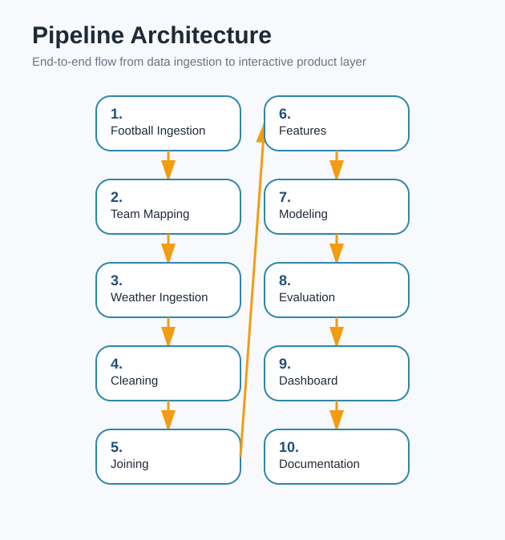

# Premier League Climate Intelligence

An end-to-end football analytics project that combines Premier League results, stadium geography, historical weather, and player-level context to test one practical question:

**Does weather measurably affect how Premier League matches are played, and can it improve prediction?**

The repository includes a reproducible data pipeline, trained models, multi-phase analysis outputs, and a Streamlit dashboard for interactive exploration.

## What This Project Does

This project:

- ingests Premier League match data across five seasons,
- maps each club to a real home stadium with latitude and longitude,
- fetches historical match-day weather for each home fixture,
- cleans and joins football and weather data,
- engineers form, seasonal, and weather features,
- trains outcome and goals models,
- evaluates weather-aware vs no-weather variants,
- runs advanced analysis phases on seasonality, team sensitivity, simulation, extreme weather, players, climate scenarios, geography, and interpretability,
- serves the results in a Streamlit dashboard.

## Scope

- Competition: Premier League
- Seasons: `2019-2020` to `2023-2024`
- Match rows in the current dataset: `1900`
- Team mappings in the current dataset: `26`
- Cached player-match rows: `54221`

## Main Question

Football commentary often claims that rain, cold, or wind changes the game. This project treats that claim as a data problem instead of a narrative:

1. Build a match-level dataset with weather attached to each home fixture.
2. Create weather and team-form features.
3. Test whether those features add measurable predictive value.
4. Explore where weather effects seem strongest: by season, by team, by player, by geography, and under simulated future conditions.

## Data Sources

The pipeline uses three external sources:

- `football-data.co.uk` for Premier League match results
- `Open-Meteo archive API` for historical weather by stadium coordinates
- `Understat` via `understatapi` for player roster and schedule data used in later analysis phases

Network access is required to rebuild raw data from scratch. Some later-stage raw files are cached locally once fetched:

- `data/raw/matches.csv`
- `data/raw/team_mapping.csv`
- `data/raw/weather.csv`
- `data/raw/understat_schedule.csv`
- `data/raw/player_match_stats.csv`

## Project Architecture



### Core folders

- `scripts/` contains the pipeline and analysis scripts
- `data/raw/` stores source-level and cached raw files
- `data/processed/` stores cleaned datasets, model artifacts, manifests, and analysis outputs
- `data/processed/models/` stores trained models and evaluation summaries
- `data/processed/analysis/` stores advanced phase outputs and charts
- `app/` contains the Streamlit dashboard
- `assets/` contains README visuals generated from project artifacts
- `logs/` stores pipeline execution logs

## Pipeline Phases

The project evolved into a 21-phase workflow. The orchestration script currently runs the reproducible build phases below and generates the dashboard-ready artifacts.

| Phase | Script | Purpose | Main outputs |
| --- | --- | --- | --- |
| 1 | `scripts/ingest_football_data.py` | Download and standardize Premier League results | `data/raw/matches.csv` |
| 2 | `scripts/create_team_mapping.py` | Build validated team-to-stadium mapping | `data/raw/team_mapping.csv` |
| 3 | `scripts/ingest_weather_data.py` | Pull match-day weather from Open-Meteo | `data/raw/weather.csv` |
| 4 | `scripts/clean_standardize_data.py` | Validate and clean match and weather inputs | `data/processed/matches_clean.csv`, `data/processed/weather_clean.csv` |
| 5 | `scripts/join_data.py` | Join cleaned match and weather records | `data/processed/final_dataset.csv` |
| 6 | `scripts/engineer_features.py` | Add targets, weather flags, seasonality, and rolling form | `data/processed/feature_dataset.csv` |
| 7 | `scripts/train_models.py` | Train match outcome and total goals models | `data/processed/models/*.joblib`, `training_metadata.json` |
| 8 | `scripts/evaluate_models.py` | Compare models with baselines and no-weather variants | `evaluation_metrics.json`, `insight_summary.txt` |
| 9 | `app/dashboard.py` | Interactive exploration layer | Streamlit app |
| 10 | `scripts/generate_readme_assets.py` | Generate README visuals | `assets/*.png`, `assets/pipeline_diagram.svg` |
| 11-12 | `scripts/analyze_temporal_and_climate_sensitivity.py` | Seasonal analysis and team sensitivity scoring | phase 11 and 12 CSV/TXT/HTML outputs |
| 13-15 | `scripts/analyze_causal_simulation_extreme.py` | Controlled comparison, scenario simulation, extreme weather analysis | phase 13 to 15 outputs |
| 16-19 | `scripts/analyze_player_future_geo_interpretability.py` | Player climate profiles, future scenarios, geography, interpretability | phase 16 to 19 outputs |
| 20-21 | `scripts/run_pipeline.py` + repo polish | Orchestration, logging, validation, automation maturity | `logs/`, `pipeline_manifest.json` |

## Data Flow

```text
football-data.co.uk -> matches.csv
team mapping script -> team_mapping.csv
Open-Meteo archive -> weather.csv
clean + validate -> matches_clean.csv + weather_clean.csv
join -> final_dataset.csv
feature engineering -> feature_dataset.csv
training -> model artifacts
evaluation + analysis -> metrics, summaries, charts
dashboard -> interactive exploration layer
```

## Features Used By The Models

The training pipeline uses `39` model features spanning four groups:

- raw weather measures: temperature, apparent temperature, humidity, rain, wind
- derived weather flags: rain, cold, hot, windy, humidity, freezing, heatwave, storm, extreme-weather indicators
- temporal context: month, season start year, season progress, seasonal one-hot flags
- team form and strength proxies: rolling points, goals for, goals against, goal difference, strength gap, match importance proxy

Targets:

- classification target: `match_result`
- regression target: `total_goals`

## Models

Two supervised models are trained from `data/processed/feature_dataset.csv`:

- `LogisticRegression` for match outcome classification
- `RandomForestRegressor` for total goals regression

The split is chronological rather than random:

- train rows: `1509`
- test rows: `391`
- train period: `2019-08-09` to `2023-05-24`
- test period: `2023-05-25` to `2024-05-19`

This is important because the project is trying to mimic a realistic forecasting setup instead of leaking future matches into training.

## Current Results

The values below come from `data/processed/models/evaluation_metrics.json` in the current repository state.

### Match outcome model

- model: `LogisticRegression`
- metric: accuracy
- test accuracy: `0.4910`
- majority-class baseline: `0.4655`
- lift over baseline: `+0.0256`
- no-weather model accuracy: `0.4783`
- weather delta vs no-weather version: `+0.0128`

### Total goals model

- model: `RandomForestRegressor`
- metric: MAE
- test MAE: `1.3919`
- baseline MAE: `1.3960`
- improvement over baseline: `0.0040`
- no-weather model MAE: `1.3906`
- weather delta vs no-weather version: `-0.0013`

### Practical interpretation

- Weather helps the current outcome classifier a little.
- Weather does not clearly help the current goals regressor beyond the no-weather version.
- The effect size is real but small, so weather matters more as a context variable than as a dominant driver.

## Key Analytical Findings

These are taken from the generated phase summaries currently stored in `data/processed/analysis/`.

### Temporal and seasonal effects

- Highest-scoring month/temperature bucket: `Aug` at `25C+` with `4.67` goals
- Lowest-scoring month/temperature bucket: `Jun` at `15-20C` with `2.00` goals
- Winter rain impact on goals: `+0.22`
- Summer rain impact on goals: `-0.09`

Interpretation: weather effects are not stable across all contexts; they depend on season and match conditions.

### Team climate sensitivity

- Most affected team in the current index: `Everton` at `13.43`
- Least affected team in the current index: `Sheffield United` at `-26.81`
- Highly affected teams (`index >= 5`): `7`
- Weather-resilient teams (`index < 0`): `13`

### Climate scenario stress test

- In the `warmer_and_wetter` scenario, predicted goals move by `+0.58%`
- The same scenario changes average home-win probability by `-3.33%`

This is a controlled model stress test, not a real-world forecast.

### Interpretability

- Top classification driver: `apparent_temperature_gap`
- Top regression driver by permutation importance: `rain`
- Weather accounts for about `68.6%` of absolute classification coefficient mass and `52.8%` of positive regression permutation importance in the phase 19 analysis

Interpretation: team strength and form still matter a lot, but weather remains visible enough to move probabilities and expectations at the margin.

## Dashboard

The Streamlit dashboard in `app/dashboard.py` is a single-page app with a hero landing section and five inline tabs. It uses a Yacht Club colour palette (`#F2F0EF`, `#BBBDBC`, `#245F73`, `#733E24`) with a teal-to-rust gradient hero banner over a stadium background image.

### Tabs

1. `📊 Climate Overview` — temperature bands, seasonal rain impact, permutation feature importance, pre-computed climate scenarios, monthly temperature × goals heatmap
2. `🏆 Team Rankings` — climate sensitivity index by club, regional donut chart, stadium map, expandable detail table
3. `⚽ Match Simulator` — live fixture predictor with custom weather sliders, result pill, probability delta chart, weather condition badges
4. `🌡️ Future Scenarios` — custom climate shift sliders applied to all 1,900 matches, delta metrics and outcome shift chart
5. `⛈️ Extreme Weather` — match history filtered by condition (heavy rain, strong wind, freezing, any extreme), overview bar charts, goals distribution

### Demo


## How To Run

### 1. Create and activate a virtual environment

PowerShell:

```powershell
python -m venv venv
.\venv\Scripts\Activate.ps1
```

### 2. Install dependencies

```powershell
pip install -r requirements.txt
```

### 3. Run the full pipeline

```powershell
python scripts/run_pipeline.py --python .\venv\Scripts\python.exe
```

The pipeline writes:

- execution logs to `logs/`
- a run manifest to `data/processed/pipeline_manifest.json`

### 4. Run a subset of the pipeline

The orchestrator supports step boundaries:

```powershell
python scripts/run_pipeline.py --from-step phase06_engineer_features --to-step phase08_evaluate_models --python .\venv\Scripts\python.exe
```

Available step names:

- `phase01_ingest_matches`
- `phase02_team_mapping`
- `phase03_ingest_weather`
- `phase04_clean_standardize`
- `phase05_join_data`
- `phase06_engineer_features`
- `phase07_train_models`
- `phase08_evaluate_models`
- `phase11_12_temporal_climate`
- `phase13_15_causal_simulation_extreme`
- `phase16_19_player_future_geo_interpretability`
- `phase10_assets`

### 5. Run scripts manually

```powershell
python scripts/ingest_football_data.py
python scripts/create_team_mapping.py
python scripts/ingest_weather_data.py
python scripts/clean_standardize_data.py
python scripts/join_data.py
python scripts/engineer_features.py
python scripts/train_models.py
python scripts/evaluate_models.py
python scripts/analyze_temporal_and_climate_sensitivity.py
python scripts/analyze_causal_simulation_extreme.py
python scripts/analyze_player_future_geo_interpretability.py
python scripts/generate_readme_assets.py
```

### 6. Launch the dashboard

```powershell
streamlit run app/dashboard.py
```

## Important Notes

- The full rebuild depends on external APIs and can take time.
- Phase `16-19` uses Understat-derived data and may reuse cached files in `data/raw/`.
- The dashboard expects pipeline artifacts to exist before launch and will stop with a clear error if they are missing.
- The project already includes generated outputs, so you can inspect results without rerunning every step.

## Repository Structure

```text
.
|-- app/
|   |-- dashboard.py
|   `-- utils/
|       |-- constants.py
|       |-- data_loader.py
|       |-- model_utils.py
|       `-- styles.py
|-- assets/
|   |-- dashboard_home.png
|   |-- dashboard_overview.png
|   |-- dashboard_simulator.png
|   |-- dashboard_rankings.png
|   |-- dashboard_extreme.png
|   `-- pipeline_diagram.svg
|-- data/
|   |-- processed/
|   |   |-- analysis/
|   |   `-- models/
|   `-- raw/
|-- logs/
|-- notebooks/
|-- scripts/
|   |-- analyze_causal_simulation_extreme.py
|   |-- analyze_player_future_geo_interpretability.py
|   |-- analyze_temporal_and_climate_sensitivity.py
|   |-- clean_standardize_data.py
|   |-- create_team_mapping.py
|   |-- engineer_features.py
|   |-- evaluate_models.py
|   |-- capture_screenshots.py
|   |-- generate_readme_assets.py
|   |-- ingest_football_data.py
|   |-- ingest_weather_data.py
|   |-- join_data.py
|   |-- run_pipeline.py
|   `-- train_models.py
|-- .gitignore
|-- README.md
`-- requirements.txt
```

## Future Improvements

Reasonable next steps for the project would be:

- add richer strength signals such as league table state, betting odds, injuries, or expected-goals priors
- replace the single holdout with rolling backtests or time-series cross-validation
- tune model hyperparameters instead of using a mostly fixed configuration
- add kickoff time and more detailed weather timing if source data becomes available
- publish the dashboard and automate scheduled refreshes

## Summary

This repository is more than a simple dashboard demo. It is a full football-weather analytics workflow with:

- reproducible ingestion,
- validation at each stage,
- trained predictive models,
- advanced downstream analysis,
- an interactive dashboard,
- generated documentation assets.

If you want to understand the project quickly, start with:

1. `scripts/run_pipeline.py`
2. `scripts/train_models.py`
3. `scripts/evaluate_models.py`
4. `app/dashboard.py`
